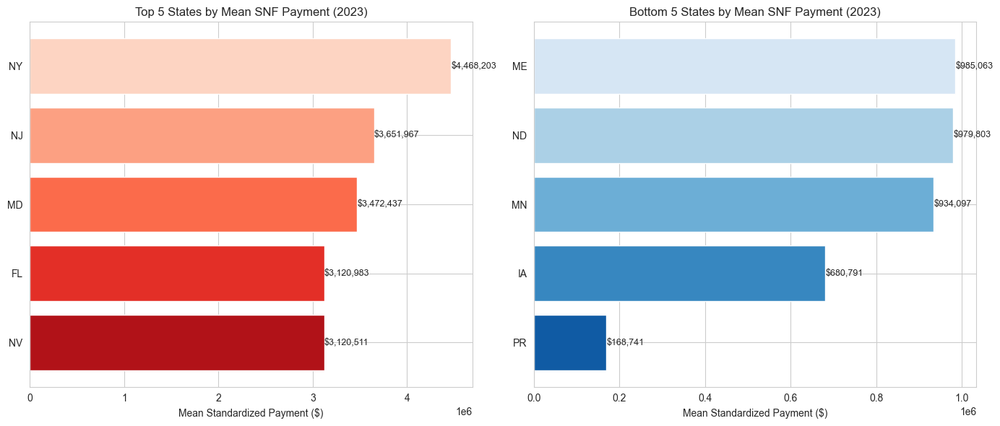
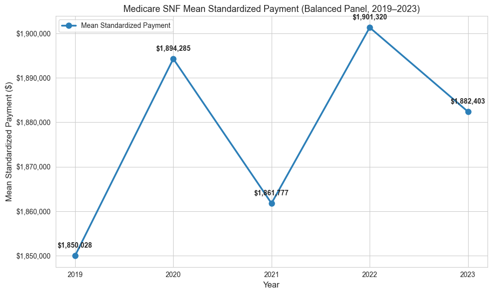

# Medicare Skilled Nursing Facility Payment Analysis

An analysis of Medicare Skilled Nursing Facility (SNF) standardized payments using CMS public-use data from 2019–2023. The project combines SQL in DuckDB with Python for quality assurance, statistical summaries, longitudinal analysis, and visualization.

## Business question

How do total Medicare standardized payments vary across providers and states, and how did average provider payments change from 2019 through 2023 among facilities observed in every year?

## Highlights

- Analyzed 14,161 provider-level records for 2023.
- Compared the five highest- and lowest-average states and territories.
- Examined payments for providers above and below a 50% dual-eligible beneficiary threshold.
- Quantified suppressed dual-eligibility values before excluding them from the comparison.
- Built a balanced panel of 13,497 providers observed in all five years.
- Performed row-count, null, duplicate, suppression, and panel-balance checks.

## Key findings

- The 2023 mean total standardized payment was approximately **$1.85 million** per provider, while the median was approximately **$1.26 million**, indicating a right-skewed distribution.
- New York had the highest state-level provider mean in 2023; Puerto Rico had the lowest mean among the reported jurisdictions.
- Among providers with a reportable dual-eligible percentage, the group at or above 50% had a lower mean total standardized payment than the group below 50%.
- In the balanced panel, the mean rose from approximately **$1.85 million in 2019** to **$1.88 million in 2023**, with noticeable year-to-year variation.

These are descriptive results. They do not establish that dual-eligible status, geography, or the COVID-19 pandemic caused the observed differences.

## Visualizations





## Tools and methods

- **DuckDB SQL:** CSV ingestion, filtering, aggregation, ordered-set percentiles, panel construction, and validation queries
- **Python:** pandas, Matplotlib, and seaborn
- **Data quality:** row counts, null checks, duplicate checks, suppressed-value handling, and balanced-panel verification
- **Analytical design:** unweighted provider means and a five-year balanced panel

## Repository contents

- `mcpac-snf_analysis.ipynb` — complete documented analysis
- `state_comparison.png` — 2023 high/low jurisdiction comparison
- `trend_chart.png` — 2019–2023 balanced-panel trend
- `summary_results.csv` — principal 2023 results
- `trend_data.csv` — annual balanced-panel values
- `requirements.txt` — Python dependencies

## Reproduce the analysis

1. Create a Python environment and install the dependencies:

   ```bash
   pip install -r requirements.txt
   ```

2. Download the 2019–2023 **Medicare Post-Acute Care Utilization – Skilled Nursing Facility** files from the [CMS Medicare Post-Acute Care & Hospice data collection](https://data.cms.gov/provider-summary-by-type-of-service/medicare-post-acute-care-hospice).

3. Create a `data` directory beside the notebook and name the files:

   ```text
   data/mcpac-snf_2019.csv
   data/mcpac-snf_2020.csv
   data/mcpac-snf_2021.csv
   data/mcpac-snf_2022.csv
   data/mcpac-snf_2023.csv
   ```

4. Run the notebook from top to bottom. It creates an `output` directory automatically.

The source CSVs are not included because they are publicly available from CMS and can change as CMS republishes or redesigns its data products.

## Limitations

- Provider means are unweighted and therefore do not represent an average beneficiary's experience.
- Approximately 26% of 2023 provider records had a suppressed dual-eligible percentage and were excluded from that subgroup comparison.
- The balanced panel omits providers that entered or exited during the period.
- The analysis is descriptive and does not control for case mix, facility size, policy changes, or pandemic-related effects.

## Data source

Centers for Medicare & Medicaid Services, [Medicare Post-Acute Care & Hospice public-use data](https://data.cms.gov/provider-summary-by-type-of-service/medicare-post-acute-care-hospice), accessed February 2026.
